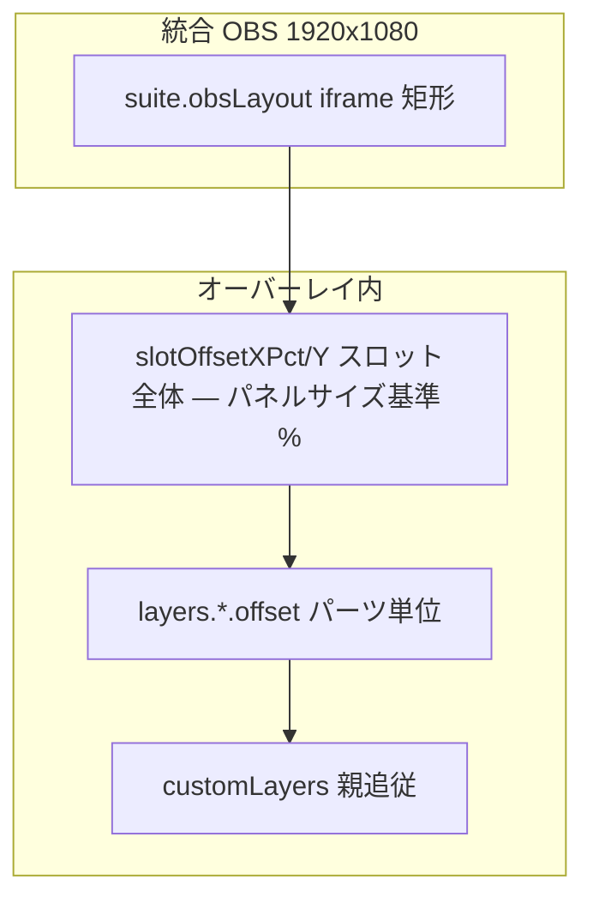

# StreamONER — 開発ガイド

**開発者・メンテナ向け**の技術リファレンスです。

| ドキュメント | 読者 | 内容 |
| --- | --- | --- |
| [README.md](./README.md) | 配信者 | インストール、タブの使い方、トラブルシュート |
| **本書** | 開発者 | 構成、ポート、IPC、永続化、実装境界 |

利用者向けの説明は README、設計・API・ストアキーの変更は本書に追記してください。

---

## 1. 概要

| 項目 | 内容 |
| --- | --- |
| スタック | Electron 28 + Vanilla HTML/CSS/JS |
| 設定 UI | `@material/web`（M3）+ `theme-apply.js` |
| OBS HTML | 透過専用 CSS（`theme.css` 非読込） |
| YouTube | `youtube-api.js` — InnerTube 優先、任意で Data API v3 |
| 配布 | `electron-builder` — Windows x64 NSIS のみ |

### ポート

起動前に `port-utils.isPortAvailable` で確認。使用中なら bind しない。

| ポート | モジュール | 用途 |
| --- | --- | --- |
| **3000** | `main.js` | `/overlay`, `/suite`, `/rehearsal`, `/suite-flags`, `/rehearsal/layout`, `/rehearsal/focus`, `/rehearsal-preview.js` |
| **3001** | `main.js` WS | Discord RPC → OBS / デスクトップ |
| **3002** | `youtube-chat-manager.js` | YouTube オーバーレイ + WS |
| **3003** | `avatar-manager.js` | アバター + `/avatar/{slot}/{key}` |
| **3920** | `remote-dashboard-server.js` | スマホダッシュボード（`remote.enabled` 時） |

### 通信概要

```text
[Electron main]
  ├─ Discord RPC + OAuth → discord-rpc-manager.js
  ├─ YouTube poll → youtube-api.js → youtube-chat-manager.js
  ├─ 配信タイマー → broadcast-timer.js
  ├─ アバター音声 → avatar-audio-manager → avatar-manager (WS :3003)
  ├─ 統合レイアウト → suite-layout.js（/suite, /rehearsal 応答時に CSS 注入）
  ├─ IPC ↔ settings / dashboard / overlay（preload.js ホワイトリスト）
  └─ SimpleStore（settings.json + safeStorage）

[OBS 推奨] http://127.0.0.1:3000/suite
  └─ iframe ×3 → :3000, :3002, :3003/overlay
  └─ 1920×1080 固定キャンバス
```

---

## 2. ディレクトリ構成

```text
src/
├── main/
│   ├── main.js                     # エントリ、HTTP/WS、IPC、トレイ
│   ├── preload.js                  # contextBridge ホワイトリスト
│   ├── youtube-api.js              # InnerTube + Data API ポーラー
│   ├── youtube-chat-manager.js
│   ├── avatar-manager.js
│   ├── avatar-slot-config.js       # スロット schema、customLayers
│   ├── avatar-audio-manager.js
│   ├── suite-layout.js             # suite.obsLayout → CSS 注入
│   ├── suite-presets.js            # データスロット（固定3枠・v3）
│   ├── rehearsal-mock-feed.js
│   ├── obs-service.js / obs-event-dispatcher.js
│   ├── session-log-manager.js
│   ├── remote-dashboard-server.js
│   └── …
├── remote/                           # スマホダッシュボード
└── renderer/
    ├── settings.html                 # タブ: general / accounts / overlay / chat / avatar
    ├── settings/                     # settings-*.js（script 順序依存）
    ├── dashboard.html / dashboard-app.js
    ├── suite-combined-overlay.html   # /suite
    ├── rehearsal-preview.html/js     # /rehearsal（ドラッグ編集）
    ├── avatar-overlay-runtime.js
    ├── avatar-audio-capture.js
    ├── avatar-settings-bind.js
    └── shared/
        ├── avatar-constants.js       # main と値を一致させる
        └── material/bundle.js
```

### 設定タブ ID（`settings.html`）

| `data-tab` | 表示名 | 旧名（エイリアス） |
| --- | --- | --- |
| `general` | 全般 | — |
| `accounts` | 接続 | `discord` |
| `overlay` | レイアウト | `integration` |
| `chat` | チャット | `youtube` |
| `avatar` | アバター | — |

`SETTINGS_TAB_ALIASES`（`settings-core.js`）で旧 IPC タブ名を互換。

---

## 3. 永続化

**パス:** `app.getPath('userData')` — `stream-overlay-suite`

| ファイル | 内容 |
| --- | --- |
| `settings.json` | `SimpleStore` フラット JSON |
| `viewers.json` | YouTube 視聴者コメント回数 |
| `session-logs/` | セッションログ JSON |

**暗号化（`safeStorage`）:** `clientSecret`, `yt.apiKey`, Discord / YouTube OAuth トークン

### 主なストアキー

| キー | 用途 |
| --- | --- |
| `suite.discordEnabled` / `suite.youtubeEnabled` | 機能 ON/OFF |
| `suite.obsLayout` | 統合 OBS iframe 配置（`suite-layout.js`） |
| `suite.presets` | データスロット v3（`data-slot-1`〜`3`） |
| `yt.videoId` / `yt.apiKey` | YouTube 動画・API キー |
| `yt.chatSource` | `auto` / `innertube` / `dataapi`（`youtube-api.js`） |
| `yt.superChatTiers` | スパチャ段階 |
| `yt.batchProcessLimit` | 1 ポーリングあたり処理上限（既定 50） |
| `avatar.p1Slot` / `avatar.p2Slot` | スロットオブジェクト（`customLayers` 含む） |
| `avatar.enabled` | アバター ON（全般トグルと同期） |
| `obs.eventActions` | OBS イベント連動ルール |
| `obs.wsHost` / `obs.wsPort` / `obs.wsPassword` | OBS WebSocket |
| `remote.enabled` / `remote.port` | スマホダッシュボード |
| `ui.themePreference` / `ui.accentPreset` | テーマ |
| `customCssPath` | 全オーバーレイ共通 CSS |

レガシー `avatar.p1ImageClosed` 等は `migrateStoreToSlots` で移行後クリア。

---

## 4. 機能モジュール

### 4.1 Discord

- RPC（net IPC）、OAuth 永続化
- OBS: `obs-overlay.html` + WS `:3001`
- デスクトップ透過: `overlay.html`（`suite.desktopOverlayEnabled`）
- `speaking-update` WS スロットル 100 ms

### 4.2 YouTube

**ポーラー:** `YouTubeChatPoller`（`youtube-api.js`）

| `yt.chatSource` | 起動時の挙動 |
| --- | --- |
| `auto`（既定） | API キーあり → Data API。なし → InnerTube。InnerTube 失敗 + キーあり → フォールバック |
| `innertube` | 常に InnerTube（キーがあっても Data API を使わない） |
| `dataapi` | Data API のみ（キー必須） |

- **InnerTube:** watch ページの `ytInitialData` → `live_chat/get_live_chat` ポーリング（公開 InnerTube キー使用、ユーザー API キー不要）
- **Data API v3:** `liveChatId` は開始時 1 回取得、`pollingIntervalMillis` と設定の長い方で間隔
- 設定 UI: **チャット** タブ → `<details>` 詳細設定（`yt-chat-source`）
- `getStatus()` に `chatSource`, `activeChatBackend`（`innertube` / `dataapi`）を返す
- `saveConfig` で `chatSource` 変更時、ポーラー稼働中なら再起動

**連携:**

- 配信タイマー: `broadcast-timer.js` — ポーラー開始/停止・`videoId` 変更でリセット
- スパチャ / メンバーシップ → `obs-event-dispatcher.js`（OBS 演出。アバター笑顔連動は廃止）
- セッションログ: `session-log-manager.js`
- OBS イベント: `obs-event-dispatcher.js`

### 4.3 アバター（PNG レイヤー）

**非採用:** Live2D / pixi / Cubism

**音声パイプライン:**

```text
マイク A/B → avatar-audio-capture.js（Analyser）
  → RMS レベル + 母音推定（周波数帯）+ 笑い検出
  → avatar-audio-manager（IPC）
  → avatar-manager（WS :3003）→ avatar-overlay-runtime.js
```

**口パク:**

- 発話判定: RMS + ヒステリシス（`SPEAK_HOLD_MS`）
- 母音: `mouth-a`〜`mouth-o` PNG があれば周波数帯で切替
- 音量 Lerp: `smoothLevel`（`LEVEL_LERP_OPEN` / `LEVEL_LERP_CLOSE`）
- 笑い: 周波数帯スコア + ホールド（`LAUGH_HOLD_MS`）

**目・表情:**

- まばたき: 三角分布で `blinkMinSec`〜`blinkMaxSec` の間隔
- LookAt: 任意 `eyes-pupil` + `lookAtEnabled`
- 笑い検出（任意）: マイク音量ベース。チャット連動の `chat-reaction` は廃止

**レイヤー:**

- 基本: `body`, `face`, `nose`, `hair1`, `hair2`, `eyes`, `mouth`
- カスタム: `customLayers[]` — `parentAnchor` で基本部位に追従（`avatar-slot-config.js`）
- 動き: sine ゆらぎ、drag 遅延追従、jiggle（喋り時の口膨らみ）

**定数:** `shared/avatar-constants.js` と `avatar-slot-config.js` の `DEFAULT_LAYER_Z` を一致させること。

### 4.4 統合 OBS（`/suite`）

- `suite-combined-overlay.html`: 1920×1080 + iframe 3 枚（`#layer-discord` 等）
- `suite-layout.js`: `suite.obsLayout` → `injectLayoutIntoHtml`
- `/rehearsal` は `#host-discord` 等の host 要素に CSS を注入（`buildLayoutCss({ rehearsal: true })`）
- `GET /suite-flags`: 1 秒ポーリングで OFF iframe を `display: none`（リハーサルも同じ）
- `Cache-Control: no-store` on `/suite`, `/rehearsal`

### 4.5 リハーサル

| 要素 | 実装 |
| --- | --- |
| URL | `GET /rehearsal` → `rehearsal-preview.html` + `rehearsal-preview.js` |
| モック | `rehearsal-mock-feed.js` → `youtube-chat-manager` |
| レイアウト取得 | `GET /rehearsal/layout` |
| レイアウト保存 | `POST /rehearsal/layout` → `suite.obsLayout` |
| 設定フォーカス | `POST /rehearsal/focus` → `focus-suite-layout-panel` IPC |
| 双方向同期 | 設定変更 → リハーサルが 1.5 秒ポーリング。編集中は操作中・選択中パネルを除き反映。ドラッグ保存 → `suite-layout-changed` IPC |

### 4.6 データスロット（`suite-presets.js`）

- 固定 3 枠: `data-slot-1`〜`3`（`STORE_VERSION` 3）
- 保存: `suiteObsLayout`, `youtubeOverlay`, `avatarVisual`（`p1Slot`/`p2Slot` 丸ごと＝`customLayers` 含む）, `obsEventActions`, `customCssPath`
- 除外: 機能 ON/OFF、API キー、動画 ID、NG、マイク等

### 4.7 ダッシュボード

- ヘッダー: 設定・リハーサル / ランプ・タイマー
- 操作バー: ミュート・シーン・チャット取得・OBS・配信表示 ON/OFF
- 右ペイン: ピン・セッションログ・参加者・NG
- 状態: `shared/status-indicator.js` + `DashboardControls`
- 非表示時 IPC 抑制: `broadcastToDashboard`

### 4.8 スマホダッシュボード

- `remote-dashboard-server.js`（既定 :3920）
- ヘッダー + ボトムナビ（リモコン / チャット）
- `remote-event-hub.js` で PC と同期

### 4.9 パフォーマンス

| 対策 | 実装 |
| --- | --- |
| チャット欄の再描画抑制 | `contain: strict` / `content`（dashboard, remote, youtube-overlay） |
| 静的ファイル | `static-file-cache.js` |
| アバター非表示時 tick | `OBS_HIDDEN_TICK_MS`（Page Visibility） |
| AudioContext suspended 対策 | `avatar-audio-capture.js` で `resume()` |
| 単一インスタンス | `requestSingleInstanceLock` |

---

## 5. HTTP API（:3000）

| パス | メソッド | 用途 |
| --- | --- | --- |
| `/overlay` | GET | Discord OBS HTML |
| `/suite` | GET | 統合 OBS（レイアウト CSS 注入） |
| `/rehearsal` | GET | リハーサル（host 用 CSS 注入） |
| `/suite-flags` | GET | `{ discordEnabled, youtubeEnabled, avatarEnabled }` |
| `/rehearsal/layout` | GET/POST | レイアウト取得・部分更新 |
| `/rehearsal/focus` | POST | 設定ウィンドウへパネルフォーカス |
| `/rehearsal-preview.js` | GET | リハーサル UI スクリプト |
| `/custom-css` | GET | カスタム CSS 配信 |

---

## 6. IPC

### ウィンドウ

| ウィンドウ | 作成 | 主な invoke |
| --- | --- | --- |
| 設定 | `createSettingsWindow({ tab })` | `save-settings`, `save-yt-config`, `save-suite-features`, `save-avatar-config` |
| ダッシュボード | `createDashboardWindow()` | `start-yt-poller`, `get-broadcast-timer`, セッションログ系 |
| アバタープレビュー | `createAvatarPreviewWindow()` | `open-avatar-preview` |

### プッシュイベント（抜粋）

`rpc-status-changed`, `yt-status-changed`, `yt-message`, `avatar-status-changed`, `avatar-config-changed`, `broadcast-timer-changed`, `suite-features-changed`, `suite-presets-changed`, `suite-layout-changed`, `focus-suite-layout-panel`, `session-log-changed`, `navigate-settings-tab`

`open-settings-window` に `{ tab: 'overlay' }` 等。`SETTINGS_TAB_ALIASES` で旧名互換。

---

## 7. アバター座標の 3 層



**設定の流れ:** `avatar-settings-bind.js`（`data-f`）→ `save-avatar-config` → `buildSlotFromForm` → `avatar.p1Slot` → `slotToOverlay` → WS `init`

---

## 8. 開発コマンド

```bash
npm install
npm run build:ui      # Material Web → bundle.js
npm run build:icons   # md-icon フォント
npm run watch:ui      # 開発中監視
npm start             # Electron 開発起動
npm run start:win     # Windows: コンソール UTF-8 にして起動（PowerShell 文字化け対策）
npm run build         # Windows インストーラ
npm run preview:ui    # ブラウザのみ UI 確認（:5190）
```

### 確認ポイント

- ポート 3000–3003 競合なし
- `/suite` 1920×1080、OBS も同サイズ
- `yt.chatSource`: auto / innertube / dataapi の切替と `activeChatBackend` 表示
- リハーサル: ドラッグ保存 → 設定フォーム同期、設定変更 → リハーサル反映（編集中は選択パネル保護）
- アバター: 母音口形、LookAt、customLayers、データスロット保存。統合レイアウト既定幅 960px
- `/suite-flags`: 機能 OFF で iframe 非表示
- 設定エクスポートにシークレットが含まれないこと

---

## 9. UI プレビュー（Electron なし）

```bash
npm run preview:ui
```

`http://127.0.0.1:5190/` — `mock-electron-api.js` で IPC スタブ。`/rehearsal` でレイアウト編集・`/suite-flags` 連動を確認可能。レイアウトは `preview-obs-layout.json` と設定画面で 1.5 秒ごとに双方向同期。

### レイアウト用 CSS 約束

インライン `style="margin-..."` は使わず `app-field`, `app-stack-md`, `app-grid-2` 等の共通クラスを使用。

---

## 10. 意図的に対応しない項目

| 項目 | 理由 |
| --- | --- |
| Live2D / pixi | PNG レイヤー方針 |
| Discord 発話をアバター口パクに合成 | マイク閾値のみ（遅延・誤検知回避） |
| 参加者一覧エクスポート | ニーズ薄 |

---

## 11. ドキュメント更新ルール

| 変更の種類 | 更新先 |
| --- | --- |
| OBS 手順、タブの使い方、トラブルシュート | README.md |
| IPC、ポート、ストアキー、モジュール設計 | 本書 |
| URL・既定サイズなど利用者にも影響する変更 | **両方** |

---

## 12. バックログ（低優先）

| 項目 | メモ |
| --- | --- |
| グローバルホットキー | 未実装 |
| macOS / Linux インストーラ | 現状 Win のみ |
| InnerTube パースの自動テスト | 手動確認中心 |
